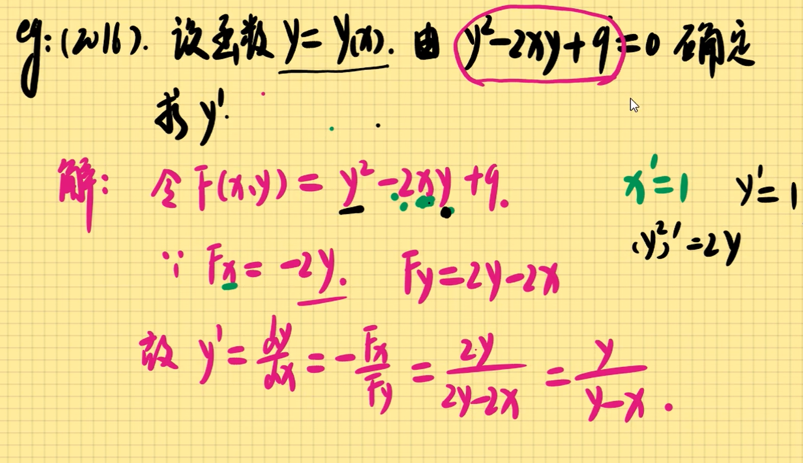

### 导数的定义式 

### 左右导数及其相关结论

可导必连续，连续未必可导

例题

#### 函数不可导的情况

#### <u>各大类函数的求导公式</u>

#### 导数的四则运算 复合运算

##### 四则运算

tip:避免对分式直接求导

##### 复合运算(求导)

抽象复合函数

 ##### 分段函数求导

题  可导->连续->左右极限相等->左右导数相等,洛必达求极限

##### 隐函数求导

定义

练习题，待做

