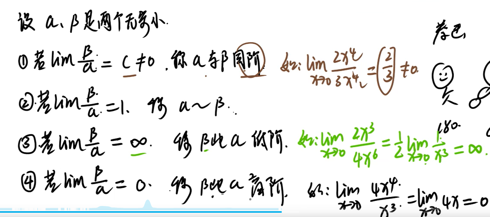

### 无穷比无穷形求极限

### 0比0形求极限

#### 常用等价无穷小量

### 洛必达法则

### 0比无穷形

例题 幂×对数

#### 无穷减无穷

 

#### u^v 极限

例题1

### 极限计算小结

## 左右极限

极限存在==左右极限存在且相等

例题一，分段函数求极限，要先求左右极限是否相等 

### 无穷小量及其比较

例题1

例题

### 曲线的渐近线

##### 水平渐近线

##### 垂直渐近线

#### 斜渐近线（不考）

